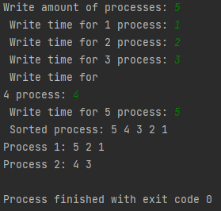
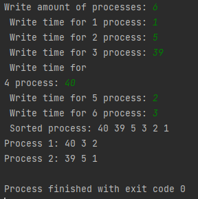

### 1 лабораторная работа "Моделирование работы планировщика ОС в двухпроцессорной ОС"

_Задание_: В ОС в каждый момент времени в очереди процессов, готовых к исполнению, находятся
несколько процессов. Для каждого процесса задается время выполнения. Распределить
процессы по процессорам так, чтобы время загрузки каждого из процессоров было по
возможности равным.  

_Алгоритм_:
1. Упорядочить элементы множества по убыванию (или по возрастанию).
2. Если время обработки различное, то процесс поступает на выполнение на тот
   процессор, где суммарное время обработки меньше. Для случая равных времён, помещаем
   на 1-ый процессор.

_Пример работы программы_:
- **Для 5 процессов:** 
  
- **Для 6 процессов:** 
  
